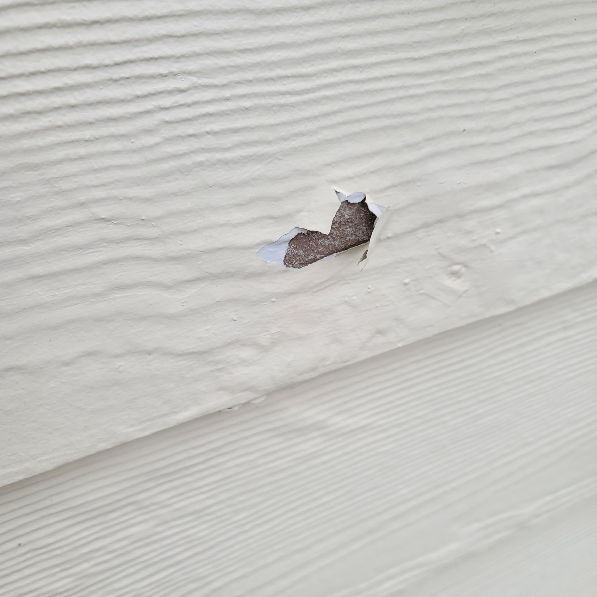

Here is an issue we have encountered this last season. This type of blistering happens when moisture is encapsulated between the substrate and existing layers causing it to fill with water and "blister". The first step is to find the source of moisture. Stay tuned as we work on resolving this issue!

*

1. 